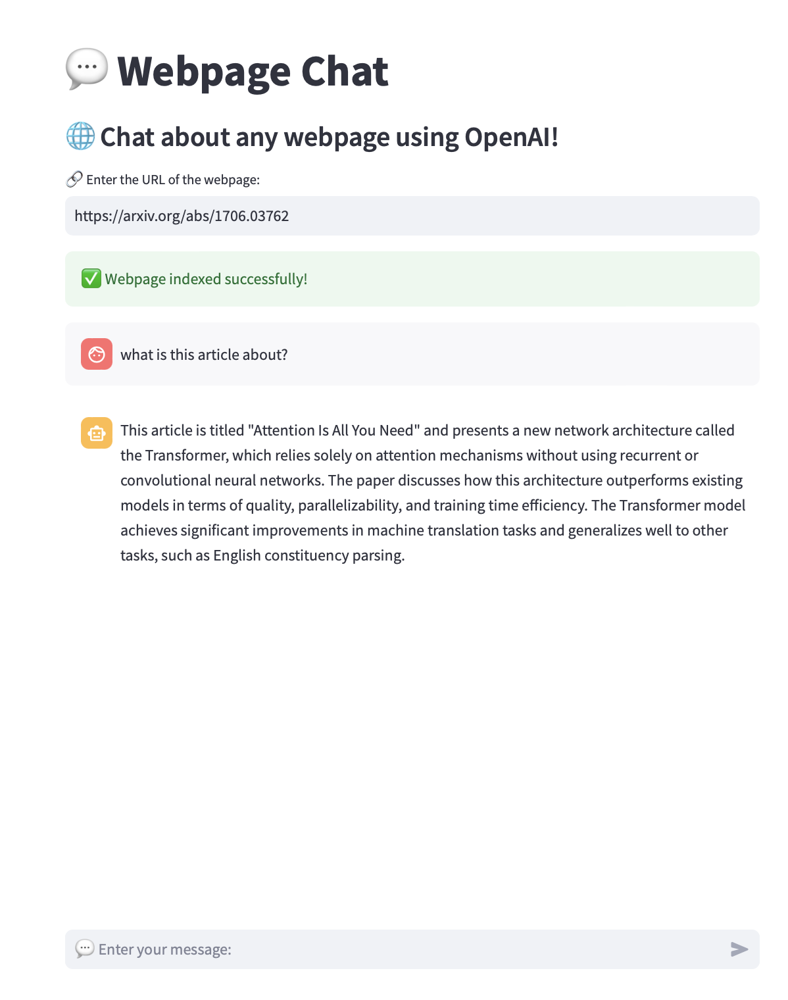

# Webpage Chat



## Description
Webpage Chat is a web application that allows users to chat with the content of any webpage using OpenAI's GPT-3.5-turbo language model. It extracts information from a given URL, indexes it, and enables users to ask questions about the webpage's content.

## Features
- Extract and index content from any webpage
- Chat interface for asking questions about the indexed content
- Utilizes OpenAI's GPT-3.5-turbo model for generating responses
- Maintains chat history for context-aware conversations

## Installation
1. Clone this repository
2. Install required packages using the provided `requirements.txt` file:
   ```
   pip install -r requirements.txt
   ```
3. Create a `.env` file in the project root and add your OpenAI API key:
   ```
   OPENAI_API_KEY=your_api_key_here
   ```

## Usage
1. Run the Streamlit app:
   ```
   streamlit run chat_app.py
   ```
2. Enter a webpage URL in the input field
3. Start chatting about the webpage content

## Dependencies
The project dependencies are listed in the `requirements.txt` file. The main libraries used are:
- Streamlit
- OpenAI
- LlamaIndex
- python-dotenv

To install all dependencies, use the command mentioned in the Installation section.

## Note
Ensure you have a valid OpenAI API key to use this application.
